# 计算机组成原理

## 第一章 计算机系统概论

### 1.1. 计算机系统简介

**计算机的软硬件概念**

1. 计算机系统
* 硬件： 计算机的实体，如主机、外设等
* 软件： 具有各类特殊功能的信息（程序）组成
  * 系统软件：用来管理整个计算机系统
     语言处理程序、操作系统、服务性程序、数据库管理系统、网络软件 
  * 应用软件：按任务需要编制成的各种程序
2. 计算机系统的层次结构
* 系统复杂性管理的方法：``**抽象**``
  * 对于一个过程的某些细节有目的的隐藏，以便把其他方面、细节或者结构表达地更清楚。 --百度百科
  * 指高级的模型，和低级的实体相对。 --维基百科
  * 隐藏系统中不重要的细节。 David Haris
* 从程序的角度对计算机的层次进行抽象
    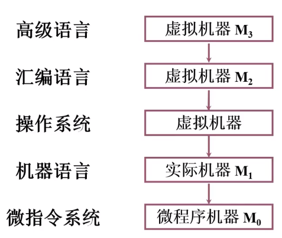
    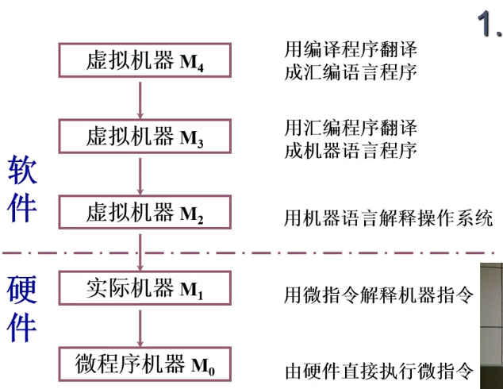
    软件与硬件之间的虚线表示计算机系统软硬件的接口
3. 计算机组成与计算机体系结构从研究内容上来说的区别 
   * 计算机体系结构：机器语言程序员所见到的计算机系统的属性、概念性的结构和功能特性。定义了计算机系统软硬件的交界面，定义了软硬件交互的接口。
   * 计算机组成：实现计算机体系结构所体现的属性

### 1.2. 计算机的基本组成

1. 冯·诺依曼计算机的特点
* 计算机由五大部件组成：运算器、控制器、存储器、输入设备、输出设备
* 指令和数据已同等地位存与存储器中，可按地址访问
* 指令和数据用二进制表示
* 指令由**操作码**和**地址码**组成
* *存储程序*（核心特征）
* 以运算器为中心
2. 冯诺依曼计算机硬件框图
  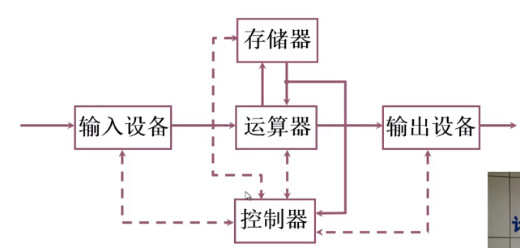
  * 运算器：完成算数运算、逻辑运算
  * 存储器：存放数据和程序
  * 控制器：指挥程序运行
  * 输入设备：将信息转换为机器能识别的信息
  * 输出设备：将计算机处理的结果转换成人们熟悉的形式

  存在的问题：

  * 以运算器为中心会使得运算器比较繁忙
  * 该框图比较乱，不具有层次化的特征
3. 计算机硬件框图
  * 以存储器为中心的计算机硬件框图
  
    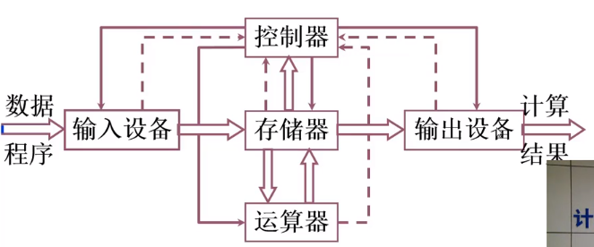
  * 现代计算机硬件框图
    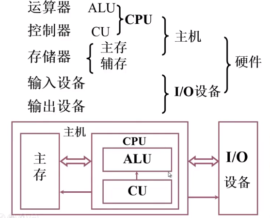 
  * 层次化（Hierachy）：将被设计的系统划分为多个模块和子模块
  * 模块化（Modularity）：有明确定义的功能和接口
  * 规则性（Regularity）：使模块更容易被重用

### 计算机的工作过程
  
1. 主存储器的基本组成
  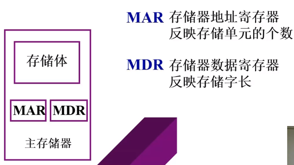

  存储体由多个存储单元组成，每个存储单元又包含若干个存储原件，每个存储原件能寄存一位二进制代码‘0’或‘1’。存储单元按地址寻访

  * 存储单元：存放一串二进制代码
  * 存储字：存储单元中二进制代码的组合
  * 存储字长：存储单元中二进制代码的位数
  
  **主存**
  1. 存储体
  2. MAR（存储器地址寄存器）：反映存储单元的个数
  3. MDR（存储器数据寄存器）：反映存储字长

2. 运算器的基本组成与操作过程
   
    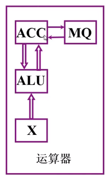 

  运算器的组成ALU+至少3个寄存器：

  1. 算数逻辑单元（ALU）（运算器的核心）
  2. 寄存器：保存参与运算的数据
    * 累加器（ACC）
    * 数据寄存器（X）
    * 乘商寄存器（MQ）

  各类寄存器中存放的各类操作数：

  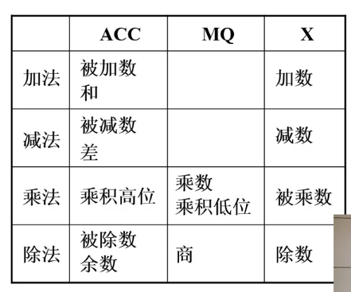

* 加法
  
  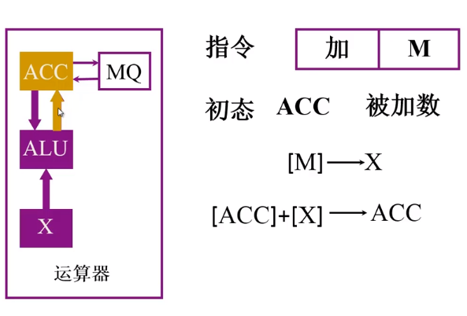
   * 加法指令中，地址码M给出加数在内存中的地址
  
      
   * 初态：被加数被存入到ACC中，加数存在X寄存器中
   * 操作1：将加数从M内存单元中取出，存入X寄存器
   * 操作2：ALU对[ACC]和[X]进行加法操作
   * 操作3：ALU将结果保存在ACC寄存器中

* 减法
  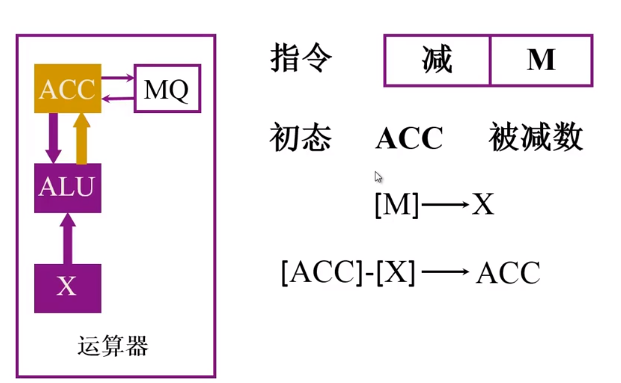
  * 减法指令中，地址码M给出减数的地址
     
  * 初态：被减数被存入到ACC中，减数存在内存单元为M的地址中
  * 操作1：将加数从M内存单元中取出，存入X寄存器
  * 操作2：ALU对[ACC]和[X]进行减法操作
  * 操作3：ALU将结果保存在ACC寄存器中

* 乘法
  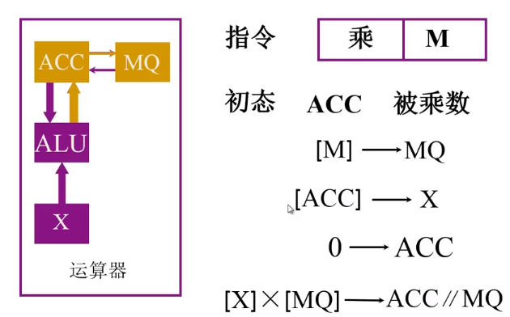
  * 乘法指令中，地址码M给出乘数的地址
    
  * 初态：被乘数被存入到ACC中
  * 操作1：将乘数从M内存中取出，存入MQ寄存器 
  * 操作2：将ACC的内容送到X寄存器中
  * 操作3：把累加初值0存入ACC中，即把ACC清零
  * 操作4：进行乘法操作，将结果的高位存入ACC，将低位存入MQ

* 除法
  * 除法指令中，地址码M给出除数的地址
  * 初态：被除数被存入到ACC中
  * 操作1：将除数从M内存中取出，存入MQ寄存器 
  * 操作2：将除数从M内存单元中取出，存入X寄存器
  * 操作3：进行除法操作，将商保存在MQ寄存器中，余数保存在ACC中

3. 控制器的基本结构
   
    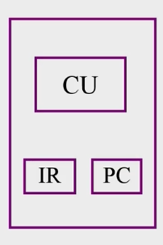

* 控制器的功能
 * 解释指令
 * 保证指令的按序执行
* 完成一条指令需要进行的操作
 * 取指令
   * 程序计数器PC：存放当前将要执行的指令的地址，执行完当前指令后将移动到下一条指令的地址，因此PC应具有计数功能（PC) + 1 -> PC
 * 分析指令
   * 指令寄存器IR：存放当前将要执行的指令
 * 执行指令
   * 控制器CU将指令从IR寄存器中取出，执行完毕后，PC指向下一条指令的地址

* 硬件系统的结构图
  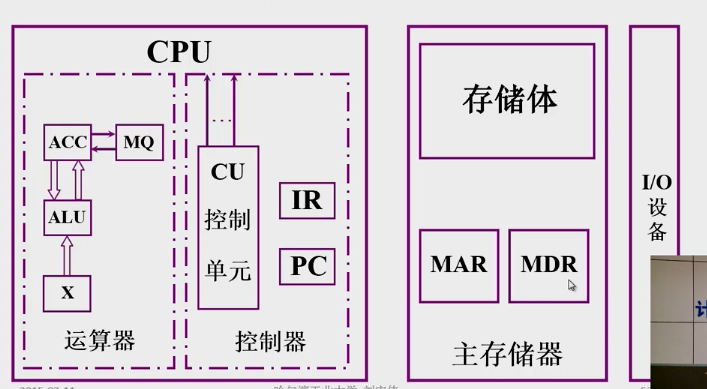 

4. 主机完成一条指令的过程

以取数指令为例

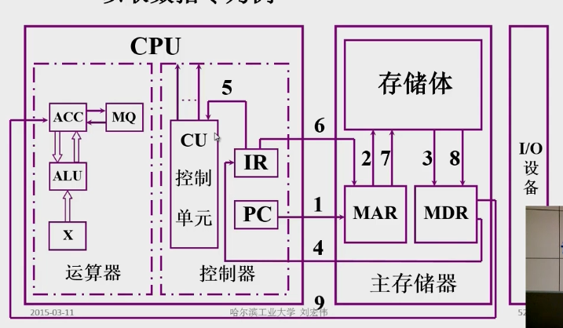

  * 第一步：取指令
    1. PC将指令的地址送给MAR
    2. 由MAR将指令的地址送给存储体
    3. 在控制器的控制之下，存储体把指定存储单元中保存的取数指令取出，送入MDR中
    4. MDR将取出的指令送入IR
  * 第二步：分析指令
  
    5. 将IR寄存器中保存的指令的操作码部分送入CU。经过译码后由CU将指令的地址部分送给存储器，将保存在M内存单元中的数据取出到ACC寄存器中
    6. 从IR的地址码部分将地址取出送入MAR。IR中保存了当前要执行的指令和当前这条指令操作数的地址。
    7. 由MAR将地址送入存储体
    8. 在控制器的控制之下，从存储体中将取数指令要求的数据取出，存入到MDR中
    9. MDR将该输入送入ACC寄存器

以存数指令为例：

  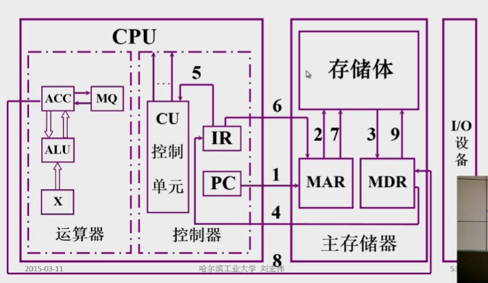

  * 第一步：取指令。将指令从存储体中取出。
    1. PC将指令的地址送给MAR
    2. 由MAR将指令的地址送给存储体
    3. 在CU的控制之下将地址中指定的地址从存储体中取出放入到MDR中
    4. MDR将取出的指令送入IR
  * 第二步：分析指令
    5. 将IR中保存的指令的操作码部分送给CU，CU对指令进行分析后发出相应的控制信号
  * 第三步：执行指令
    6. CU由控制将IR中的指令的地址码部分送入到MAR中
    7. MAR将地码送入存储体。告诉存储体将要存数据，并给出数据的地址
    8. 将ACC中的内容存入MDR中。ACC中保存从存储体中输入和输出的数据
    9.  在控制器的控制之下，将MDR中的数据保存到存储体中
   
(ax^2+bx+c)程序运行过程

  * 将程序通过输入设备送至计算机
  * 将程序首地址存入PC
  * 启动程序运行
  
  取数指令：将数据取出到ACC中

  * 取指令操作：PC->MAR->M（存储体）->MDR->IR，(PC)+1->PC ``将地址从PC中取出后PC将移动到下一条指令的地址``
  * 分析指令，取操作码OP(IR)->CU
  * 执行指令，取地址码AD(IR)->MAR->M->MDR->ACC
  * ...
  * ...
  
  经过以上三步，取数指令完成，一次进行乘法指令、加法指令循环经过这三步的指令传送后完成此程序的计算，经过最后的保存指令后即可通过打印指令输出结果。

### 1.3. 计算机硬件的主要技术指标

机器字长：CPU一次能处理数据的位数，与CPU中的寄存器位数有关（ACC、X、MQ）

运算速度:

* 主频
* 核心数，以及每个核心支持的线程数
* 吉普森法：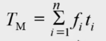

  fi代表每条指令在程序中出现的频率，计算方法有两种

  * 静态使用频率：通过程序清单计算某条指令出现的频率
  * 动态使用频率：计算程序的执行过程当中每条指令出现的频率
* CPI：执行一条指令需要的时钟周期数。通过加权平均的方法计算。
* IPC：一个执行周期可完成的指令数
* MIPS：每秒执行的百万条指令数
* FLOPS：每秒浮点运算的次数（较为合理的指标）

  衡量机器的运行速度的较为合理的指标：在相同的时间里，完成了多少算数或者是逻辑运算

存储容量：存放二进制信息的总位数

* 主存容量：
  * 存储单元个数 × 存储字长
    
    如：
    
    |MAR| MDR| 容量|
    |--|--|--|
    |10|8|1K × 8位|
    |16|32|64K × 32位|

  * 字节数

    如：
    
      $2^{13} b = 1KB$

      $2^{21} b = 256KB$
* 辅存容量
  * 字节数： 80GB

## 第二章 计算机的发展及应用

### 略

## 第三章 系统总线

### 3.1 总线的基本概念

1. 总线(Bus)是链接各个部件的信息传输线，是各个部件共享的传输介质

2. 使用总线的原因：解决分散连接的问题
* 缩减通信线路数量
* 减少设备间连接的接口
* 避免系统难以扩展

3. 总线上信息的传送

  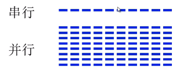

* 串行：发送方把将要传输的数据一位一位地送到总线上，接收方一位一位地从总线上取数据
* 并行：发送方把将要传输的数据多位同时送到总线上，接收方同时接受多位数据

传输距离较长，平行的线与线之间会产生干扰，会导致数据的变形。

* 并行传输通常适用于短距离传输，可集中在计算机内部
* 串行传输通常用于机器与机器、其他设备之间的数据传输

4. 总线结构举例
   1. 单总线结构框图 
   
      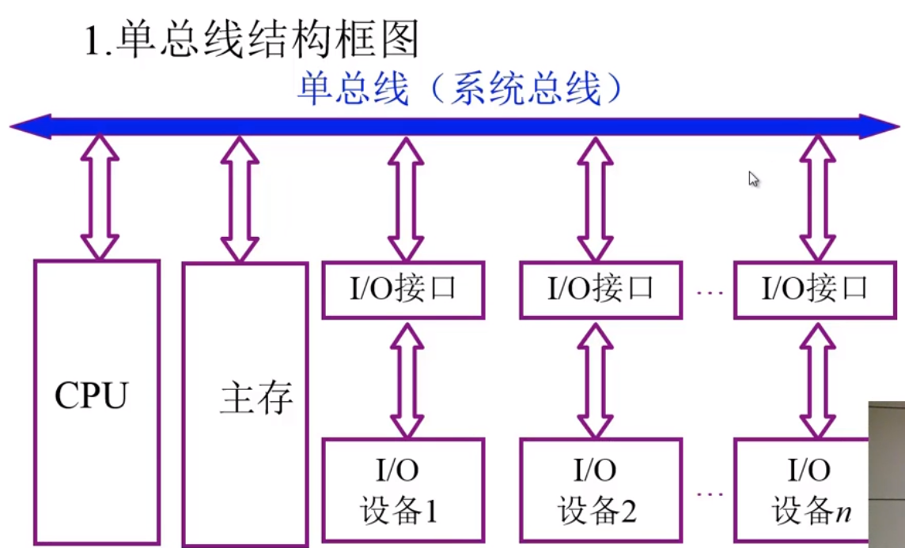

      * 在任何时刻只能有一个部件在使用系统总线，会发生总线的争用
      * 远端传输延迟高
   2. 面向CPU的双总线结构框图
      
      为CPU和主存设计专有的数据传输总线
      
      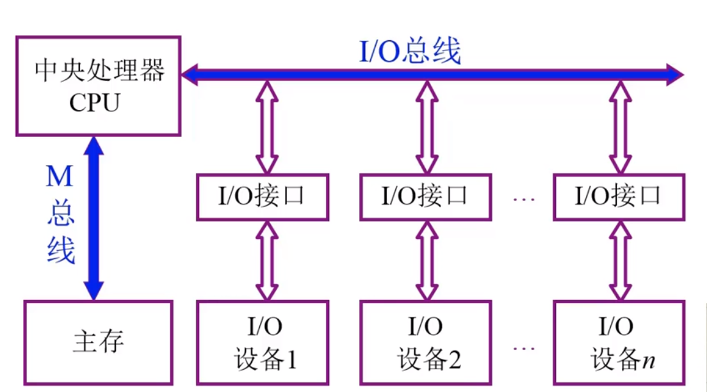 

      * 主存和IO设备之间无连接，只能通过CPU相互通信，会打断CPU的计算
   3. 以存储器为中心的双总线结构

      主存同时与系统总线和存储总线连接 

      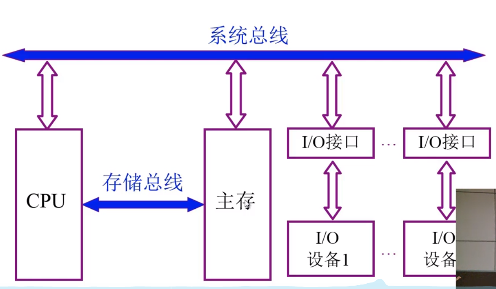

      * 现有技术暂未实现系统总线和存储总线的同时工作，但与面向CPU的双总线结构相比仍有较大优势

### 3.2 总线的分类

1. 片内总线：芯片内部的总线，完成芯片内部不同部件的连接
2. 系统总线：计算机各个部件之间的信息传输总线
   
    根据系统总线上传输的信号的不同可分为以下三类： 

    * 数据总线：双向，与机器字长、存储字长有关。通常情况下，总线的宽度 <= 机器字长
    * 地址总线：单向，与存储地址、I/O地址有关。由CPU或主设备发出。通常地址总线的条数和地址单元的个数相关
    * 控制总线：有入有出，向系统的各个部件传输控制信号，或系统的各个部件将自己的状态信号向外传输。
      >有出，如：存储器读取、存储器写入、总选允许、中断确认  
      >有如，如：中断请求、总线请求
3. 通信总线：用于**计算机与系统之间**或**计算机系统与其他系统**之间的通信。

    传输方式：

    * 串行通信总线
    * 并行通信总线

### 3.3. 总线的特性以及性能指标

1. 总线物理实现
    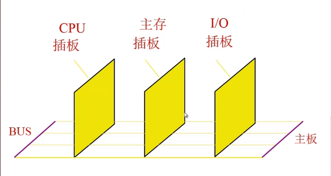
2. 总线特性
   1. 机械特性：尺寸、形状、管脚数、排列顺序
   2. 电气特性：传输方向和有效的电平范围
   3. 功能特性：每根传输线的功能，即传输何种信号：地址信号、数据信号、控制信号
   4. 时间特性：信号的时序关系
3. 总线的性能指标
   1. 总线宽度：同时可以传输多少位数据。也就是数据线的条数
   2. 标准传输率：**每秒**传输的**最大字节数**（MBps）
   3. 时钟同步/异步：同步、不同步
   4. 总线复用：**地址线**与**数据线复用**（共用）
   5. 信号线数：地址线、数据线和控制线的总和
   6. 总线控制方式：突发、自动、仲裁、逻辑、计数
   7. 其他指标：负载能力等
4. 总线标准

  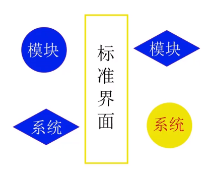

   总线标准表：

   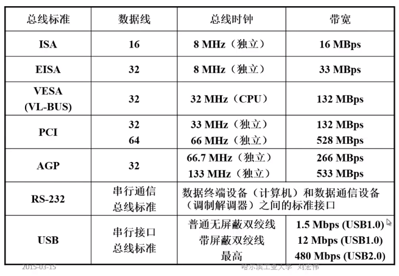

   1. ISA：工业标准体系结构
   2. EISA：在ISA基础上增加总线宽度
   3. VESA：视频电子标准协会
   4. PCI：外设部件互联标准
   5. AGP：点对点的局部总线，主要连接控制芯片和显卡
   6. RS-232：串行通信总线标准
   7. USB：通用串行总线

### 3.4. 总线结构

1. 单总线结构

  见3.1.4.1

2. 多总线结构
   1. 双总线结构

      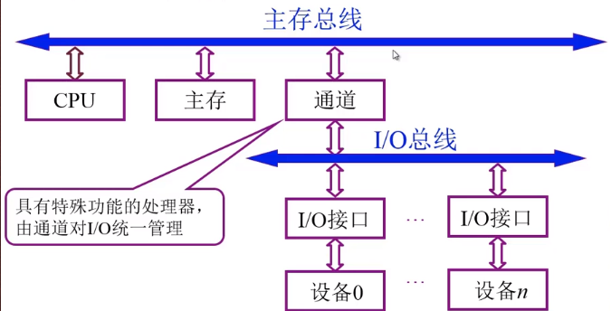

   2. 三总线结构

      

      DMA：直接存储器访问。高速设备和内存之间进行信息交换时可以通过DMA总线

      但低速设备依然要通过I/O总线
   3. 三总线结构的另一种形式

      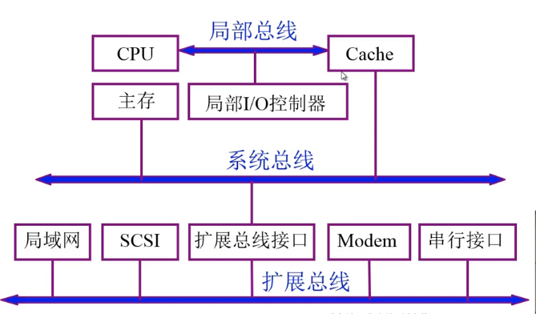

      在CPU与主存之间添加一个低容量的高速缓存，用来缓存主存中的数据

      添加一条扩展总线与系统总线相连，用于连接外部设备

      但所有外设全部连接在扩展总线上，势必会影响高速外设的速度

   4. 四总线结构

      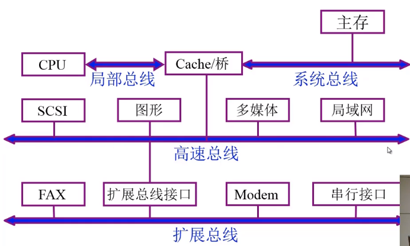

      特点：将高速设备和低速设备进行分类组织

3. 总线结构举例
   1. 传统微型机总线结构

      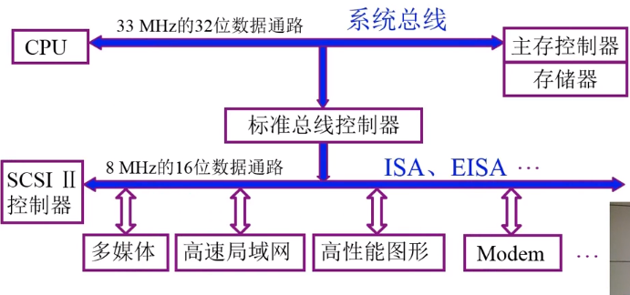

   2. VESA

      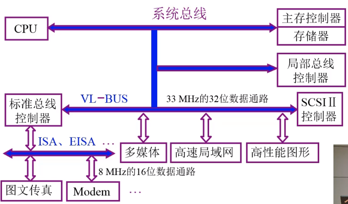

   3. PCI总线结构

      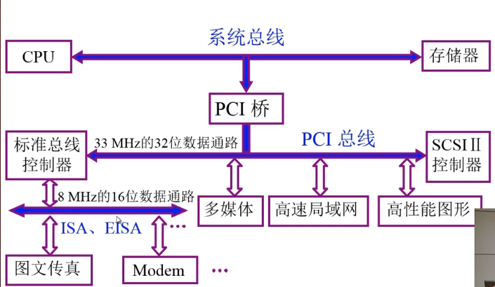

   4. 多层PCI总线结构

      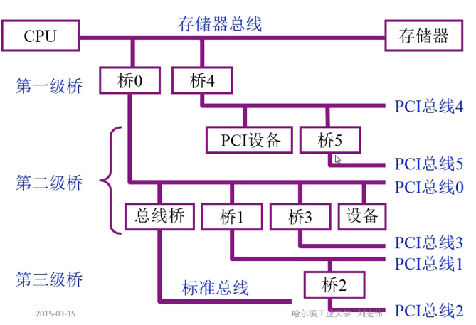

### 3.5. 总线控制

1. 总线判优控制
* 基本概念

  根据是否能提出总线请求，可将总线上的设备分为两类

  * 主设备(模块)：对总线有控制权，即可以提出总线的占用申请，且在占用了总线后可以控制和另外一台设备之间的通信
  * 从设备（模块）：只能相应从主设备发来的总线命令。不能对总线进行控制，也不能提出对总线的占用申请。

* 总线判优控制
  * 集中式：将总线的判优逻辑集成在一个部件上
    * 链式查询
    * 计数器定时查询
    * 独立请求方式
  * 分布式：将判优逻辑分布到各个设备或各个设备的端口上
* 链式查询方式
  
  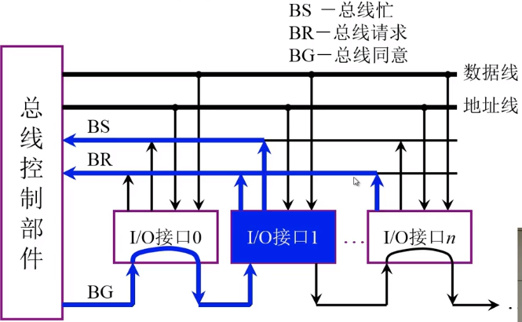 

  BR：设备发出占用请求后通过BR想总线控制部件提出占用请求
  
  BG：链式查询发出总线占用请求的设备，并为其分配总线的使用权。BG的查询顺序为各个I/O设备占用总线的优先级的先后顺序
  
  BS：设备获得总线的使用权后，通过BS设置总线忙

  优点：
  
  * 结构简单
  * 容易实现可靠性设计
  
  缺点：
  * 对电路故障非常敏感，尤其是BG。
  * 速度慢
* 计数器定时查询
  
  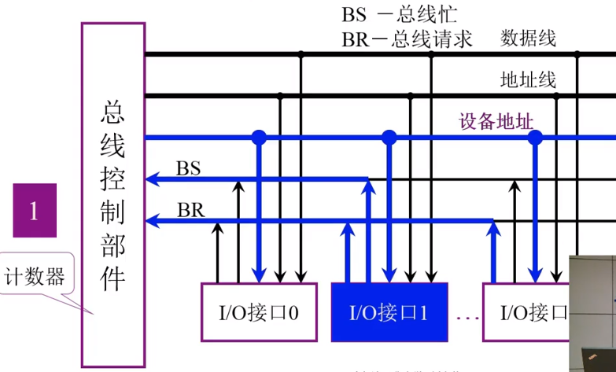

  
