# 计算机组成原理（唐朔飞）
<!-- TOC -->

* [计算机组成原理（唐朔飞）](#计算机组成原理唐朔飞)
  * [第一章 计算机系统概论](#第一章-计算机系统概论)
    * [1-1 计算机系统简介](#1-1-计算机系统简介)
    * [1-2  计算机的基本组成](#1-2-计算机的基本组成)
    * [1-3 计算机的工作过程](#1-3-计算机的工作过程)
    * [1-4  计算机硬件的主要技术指标](#1-4-计算机硬件的主要技术指标)
  * [第二章 计算机的发展及应用](#第二章-计算机的发展及应用)
    * [略](#略)
  * [第三章 系统总线](#第三章-系统总线)
    * [3-1 总线的基本概念](#3-1-总线的基本概念)
    * [3-2 总线的分类](#3-2-总线的分类)
    * [3-3  总线的特性以及性能指标](#3-3-总线的特性以及性能指标)
    * [3-4  总线结构](#3-4-总线结构)
    * [3-5  总线控制](#3-5-总线控制)
      * [同步通信](#同步通信)
      * [异步通信](#异步通信)
      * [半同步通信（同步、异步结合）](#半同步通信同步异步结合)
      * [分离式通信](#分离式通信)
  * [第四章 存储器](#第四章-存储器)
    * [4-1 概述](#4-1-概述)
      * [4-1-1  存储器分类](#4-1-1-存储器分类)
      * [4-1-2  存储器的层次结构](#4-1-2-存储器的层次结构)
    * [4-2  主存储器](#4-2-主存储器)
      * [4-2-1 概述](#4-2-1-概述)
      * [4-2-2  半导体存储芯片](#4-2-2-半导体存储芯片)
      * [4-2-3  随机存取存储器](#4-2-3-随机存取存储器)
      * [4-2-4  只读存储器(ROM)](#4-2-4-只读存储器ROM)
      * [4-2-5  存储器与CPU的连接](#4-2-5-存储器与CPU的连接)
      * [4-2-6  存储器的校验](#4-2-6-存储器的校验)
      * [4-2-7  提高访存速度的措施](#4-2-7-提高访存速度的措施)
    * [4-3  高速缓冲存储器](#4-3-高速缓冲存储器)
      * [4-3-1 概述](#4-3-1-概述)
    * [4.3.2. Cache-主存地址映射](#432-Cache-主存地址映射)
      * [4-3-3  替换算法](#4-3-3-替换算法)
    * [4-4  辅助存储器](#4-4-辅助存储器)
  * [5. 输入输出系统](#5-输入输出系统)
    * [5-1  概述](#5-1-概述)
      * [5-1-1  输入输出系统的发展概况](#5-1-1-输入输出系统的发展概况)
      * [5-1-2  输入输出系统的组成](#5-1-2-输入输出系统的组成)
    * [5-2 外部设备（I/O设备）](#5-2-外部设备IO设备)
      * [5-2-1 概述](#5-2-1-概述)
      * [5-2-2 输入设备](#5-2-2-输入设备)
      * [5-2-3 输出设备](#5-2-3-输出设备)
      * [5-2-4 其他](#5-2-4-其他)
      * [5-2-5 多媒体技术](#5-2-5-多媒体技术)
    * [5-3 I/O接口](#5-3-IO接口)
    * [5-4 程序查询方式](#5-4-程序查询方式)
      * [5-4-1 程序查询流程](#5-4-1-程序查询流程)
      * [5-4-2 程序查询方式的接口电路](#5-4-2-程序查询方式的接口电路)

<!-- /TOC -->
## 第一章 计算机系统概论

### 1-1 计算机系统简介

**计算机的软硬件概念**

1. 计算机系统
* 硬件： 计算机的实体，如主机、外设等
* 软件： 具有各类特殊功能的信息（程序）组成
  * 系统软件：用来管理整个计算机系统
     语言处理程序、操作系统、服务性程序、数据库管理系统、网络软件 
  * 应用软件：按任务需要编制成的各种程序
2. 计算机系统的层次结构
* 系统复杂性管理的方法：``抽象``
  * 对于一个过程的某些细节有目的的隐藏，以便把其他方面、细节或者结构表达地更清楚。 --百度百科
  * 指高级的模型，和低级的实体相对。 --维基百科
  * 隐藏系统中不重要的细节。 David Haris
* 从程序的角度对计算机的层次进行抽象
    
    
    软件与硬件之间的虚线表示计算机系统软硬件的接口
3. 计算机组成与计算机体系结构从研究内容上来说的区别 
   * 计算机体系结构：机器语言程序员所见到的计算机系统的属性、概念性的结构和功能特性。定义了计算机系统软硬件的交界面，定义了软硬件交互的接口。
   * 计算机组成：实现计算机体系结构所体现的属性

### 1-2  计算机的基本组成

1. 冯·诺依曼计算机的特点
* 计算机由五大部件组成：运算器、控制器、存储器、输入设备、输出设备
* 指令和数据已同等地位存与存储器中，可按地址访问
* 指令和数据用二进制表示
* 指令由**操作码**和**地址码**组成
* *存储程序*（核心特征）
* 以运算器为中心
2. 冯诺依曼计算机硬件框图
    
  * 运算器：完成算数运算、逻辑运算
  * 存储器：存放数据和程序
  * 控制器：指挥程序运行
  * 输入设备：将信息转换为机器能识别的信息
  * 输出设备：将计算机处理的结果转换成人们熟悉的形式

  存在的问题：

  * 以运算器为中心会使得运算器比较繁忙
  * 该框图比较乱，不具有层次化的特征
3. 计算机硬件框图
  * 以存储器为中心的计算机硬件框图
  
    
  * 现代计算机硬件框图
     
  * 层次化（Hierachy）：将被设计的系统划分为多个模块和子模块
  * 模块化（Modularity）：有明确定义的功能和接口
  * 规则性（Regularity）：使模块更容易被重用

### 1-3 计算机的工作过程

1. 主存储器的基本组成
    

  存储体由多个存储单元组成，每个存储单元又包含若干个存储原件，每个存储原件能寄存一位二进制代码‘0’或‘1’。存储单元按地址寻访

  * 存储单元：存放一串二进制代码
  * 存储字：存储单元中二进制代码的组合
  * 存储字长：存储单元中二进制代码的位数

  **主存**
  1. 存储体：保存程序、指令、数据
  2. MAR（存储器地址寄存器）：反映存储单元的个数
  3. MDR（存储器数据寄存器）：反映存储字长

2. 运算器的基本组成与操作过程
   
     

  运算器的组成ALU+至少3个寄存器：

  1. 算数逻辑单元（ALU）（运算器的核心）
  2. 寄存器：保存参与运算的数据

    * 累加器（ACC）
    * 数据寄存器（X）
    * 乘商寄存器（MQ）

  各类寄存器中存放的各类操作数：

  

* 加法
  
  
   * 加法指令中，地址码M给出加数在内存中的地址
  
      
   * 初态：被加数被存入到ACC中，加数存在X寄存器中
   * 操作1：将加数从M内存单元中取出，存入X寄存器
   * 操作2：ALU对[ACC]和[X]进行加法操作
   * 操作3：ALU将结果保存在ACC寄存器中

* 减法
  
  * 减法指令中，地址码M给出减数的地址
     
  * 初态：被减数被存入到ACC中，减数存在内存单元为M的地址中
  * 操作1：将加数从M内存单元中取出，存入X寄存器
  * 操作2：ALU对[ACC]和[X]进行减法操作
  * 操作3：ALU将结果保存在ACC寄存器中

* 乘法
  
  * 乘法指令中，地址码M给出乘数的地址
    
  * 初态：被乘数被存入到ACC中
  * 操作1：将乘数从M内存中取出，存入MQ寄存器 
  * 操作2：将ACC的内容送到X寄存器中
  * 操作3：把累加初值0存入ACC中，即把ACC清零
  * 操作4：进行乘法操作，将结果的高位存入ACC，将低位存入MQ

* 除法
  * 除法指令中，地址码M给出除数的地址
  * 初态：被除数被存入到ACC中
  * 操作1：将除数从M内存中取出，存入MQ寄存器 
  * 操作2：将除数从M内存单元中取出，存入X寄存器
  * 操作3：进行除法操作，将商保存在MQ寄存器中，余数保存在ACC中

3. 控制器的基本结构
   
    

* 控制器的功能
 * 解释指令
 * 保证指令的按序执行
* 完成一条指令需要进行的操作
 * 取指令
   * 程序计数器PC：存放当前将要执行的指令的地址，执行完当前指令后将移动到下一条指令的地址，因此PC应具有计数功能（PC) + 1 -> PC
 * 分析指令
   * 指令寄存器IR：存放当前将要执行的指令
 * 执行指令
   * 控制器CU将指令从IR寄存器中取出，执行完毕后，PC指向下一条指令的地址

* 硬件系统的结构图
   

4. 主机完成一条指令的过程

以取数指令为例

  * 第一步：取指令
    1. PC将指令的地址送给MAR
    2. 由MAR将指令的地址送给存储体
    3. 在控制器的控制之下，存储体把指定存储单元中保存的取数指令取出，送入MDR中
    4. MDR将取出的指令送入IR
  * 第二步：分析指令
  
    5. 将IR寄存器中保存的指令的操作码部分送入CU。经过译码后由CU将指令的地址部分送给存储器，将保存在M内存单元中的数据取出到ACC寄存器中
    6. 从IR的地址码部分将地址取出送入MAR。IR中保存了当前要执行的指令和当前这条指令操作数的地址。
    7. 由MAR将地址送入存储体
    8. 在控制器的控制之下，从存储体中将取数指令要求的数据取出，存入到MDR中
    9. MDR将该输入送入ACC寄存器

以存数指令为例：

  

  * 第一步：取指令。将指令从存储体中取出。
    1. PC将指令的地址送给MAR
    2. 由MAR将指令的地址送给存储体
    3. 在CU的控制之下将地址中指定的地址从存储体中取出放入到MDR中
    4. MDR将取出的指令送入IR
  * 第二步：分析指令
    5. 将IR中保存的指令的操作码部分送给CU，CU对指令进行分析后发出相应的控制信号
  * 第三步：执行指令
    6. CU由控制将IR中的指令的地址码部分送入到MAR中
    7. MAR将地码送入存储体。告诉存储体将要存数据，并给出数据的地址
    8. 将ACC中的内容存入MDR中。ACC中保存从存储体中输入和输出的数据
    9.  在控制器的控制之下，将MDR中的数据保存到存储体中

(ax^2+bx+c)程序运行过程

  * 将程序通过输入设备送至计算机
  * 将程序首地址存入PC
  * 启动程序运行

  取数指令：将数据取出到ACC中

  * 取指令操作：PC->MAR->M（存储体）->MDR->IR，(PC)+1->PC ``将地址从PC中取出后PC将移动到下一条指令的地址``
  * 分析指令，取操作码OP(IR)->CU
  * 执行指令，取地址码AD(IR)->MAR->M->MDR->ACC
  * ...
  * ...
  * 
  经过以上三步，取数指令完成，一次进行乘法指令、加法指令循环经过这三步的指令传送后完成此程序的计算，经过最后的保存指令后即可通过打印指令输出结果。

### 1-4  计算机硬件的主要技术指标

机器字长：CPU一次能处理数据的位数，与CPU中的寄存器位数有关（ACC、X、MQ）

运算速度:

* 主频
* 核心数，以及每个核心支持的线程数
* 吉普森法：

  fi代表每条指令在程序中出现的频率，计算方法有两种

  * 静态使用频率：通过程序清单计算某条指令出现的频率
  * 动态使用频率：计算程序的执行过程当中每条指令出现的频率
* CPI：执行一条指令需要的时钟周期数。通过加权平均的方法计算。
* IPC：一个执行周期可完成的指令数
* MIPS：每秒执行的百万条指令数
* FLOPS：每秒浮点运算的次数（较为合理的指标）

  衡量机器的运行速度的较为合理的指标：在相同的时间里，完成了多少算数或者是逻辑运算

存储容量：存放二进制信息的总位数

* 主存容量：
  * 存储单元个数 × 存储字长
    
    如：
    
    |MAR| MDR| 容量|
    |--|--|--|
    |10|8|1K × 8位|
    |16|32|64K × 32位|

  * 字节数

    如：
    
      $2^{13} b = 1KB$

      $2^{21} b = 256KB$
* 辅存容量
  
  * 字节数： 80GB

## 第二章 计算机的发展及应用

### 略

## 第三章 系统总线

### 3-1 总线的基本概念

1. 总线(Bus)是连接各个部件的信息传输线，是各个部件共享的传输介质

2. 使用总线的原因：解决分散连接的问题
* 缩减通信线路数量
* 减少设备间连接的接口
* 避免系统难以扩展

3. 总线上信息的传送

  

* 串行：发送方把将要传输的数据一位一位地送到总线上，接收方一位一位地从总线上取数据
* 并行：发送方把将要传输的数据多位同时送到总线上，接收方同时接受多位数据

在同一时刻，只允许有一个部件向总线发送信息，而多个部件可以同时从总线上接收相同的信息

传输距离较长，平行的线与线之间会产生干扰，会导致数据的变形。

* 并行传输通常适用于短距离传输，可集中在计算机内部
* 串行传输通常用于机器与机器、其他设备之间的数据传输

1. 总线结构举例
   1. 单总线结构框图 
   
      

      * 在任何时刻只能有一个部件在使用系统总线，会发生总线的争用
      * 远端传输延迟高
   2. 面向CPU的双总线结构框图
      
      为CPU和主存设计专有的数据传输总线
      
       

      * 主存和IO设备之间无连接，只能通过CPU相互通信，会打断CPU的计算
   3. 以存储器为中心的双总线结构

      主存同时与系统总线和存储总线连接 

      

      * 现有技术暂未实现系统总线和存储总线的同时工作，但与面向CPU的双总线结构相比仍有较大优势

### 3-2 总线的分类

1. 片内总线：芯片内部的总线，完成芯片内部不同部件的连接
2. 系统总线：计算机各个部件之间的信息传输总线
   
    根据系统总线上传输的信号的不同可分为以下三类： 

    * 数据总线：双向，与机器字长、存储字长有关。通常情况下，总线的宽度 <= 机器字长
    * 地址总线：单向，与存储地址、I/O地址有关。由CPU或主设备发出。通常地址总线的条数和地址单元的个数相关
    * 控制总线：有入有出，向系统的各个部件传输控制信号，或系统的各个部件将自己的状态信号向外传输。
      >有出，如：存储器读取、存储器写入、总选允许、中断确认  
      >有入，如：中断请求、总线请求
3. 通信总线：用于**计算机与系统之间**或**计算机系统与其他系统**之间的通信。

    传输方式：

    * 串行通信总线
    * 并行通信总线

### 3-3  总线的特性以及性能指标

1. 总线物理实现
    
2. 总线特性
   1. 机械特性：尺寸、形状、管脚数、排列顺序
   2. 电气特性：传输方向和有效的电平范围
   3. 功能特性：每根传输线的功能，即传输何种信号：地址信号、数据信号、控制信号
   4. 时间特性：信号的时序关系
3. 总线的性能指标
   1. 总线宽度：同时可以传输多少位数据。也就是数据线的条数
   2. 标准传输率：**每秒**传输的**最大字节数**（Mbps）
   3. 时钟同步/异步：同步、不同步
   4. 总线复用：**地址线**与**数据线复用**（共用）
   5. 信号线数：地址线、数据线和控制线的总和
   6. 总线控制方式：突发、自动、仲裁、逻辑、计数
   7. 其他指标：负载能力等
4. 总线标准

  

   总线标准表：

   

   1. ISA：工业标准体系结构
   2. EISA：在ISA基础上增加总线宽度
   3. VESA：视频电子标准协会
   4. PCI：外设部件互联标准
   5. AGP：点对点的局部总线，主要连接控制芯片和显卡
   6. RS-232：串行通信总线标准
   7. USB：通用串行总线

### 3-4  总线结构

1. 单总线结构

  见3.1.4.1

2. 多总线结构
   1. 双总线结构

      

   2. 三总线结构

      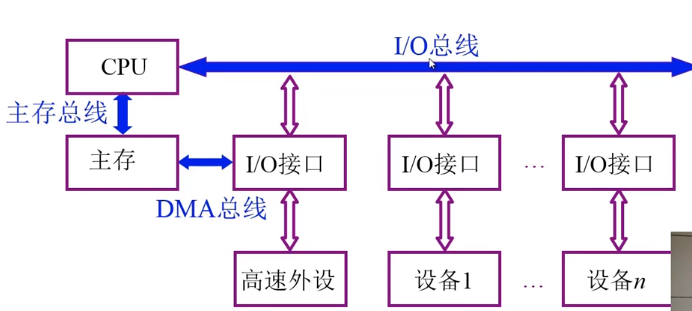

      DMA：直接存储器访问。高速设备和内存之间进行信息交换时可以通过DMA总线

      但低速设备依然要通过I/O总线
   3. 三总线结构的另一种形式

      

      在CPU与主存之间添加一个低容量的高速缓存，用来缓存主存中的数据

      添加一条扩展总线与系统总线相连，用于连接外部设备

      但所有外设全部连接在扩展总线上，势必会影响高速外设的速度

   4. 四总线结构

      

      特点：将高速设备和低速设备进行分类组织

3. 总线结构举例
   1. 传统微型机总线结构

      

   2. VESA

      

   3. PCI总线结构

      

   4. 多层PCI总线结构

      

### 3-5  总线控制

1. 总线判优控制
* 基本概念

  根据是否能提出总线请求，可将总线上的设备分为两类

  * 主设备(模块)：对总线有控制权，即可以提出总线的占用申请，且在占用了总线后可以控制和另外一台设备之间的通信
  * 从设备（模块）：只能相应从主设备发来的总线命令。不能对总线进行控制，也不能提出对总线的占用申请。

* 总线判优控制
  * 集中式：将总线的判优逻辑集成在一个部件上
    * 链式查询
    * 计数器定时查询
    * 独立请求方式
  * 分布式：将判优逻辑分布到各个设备或各个设备的端口上
* 链式查询方式
  
   

  BR：设备发出占用请求后通过BR想总线控制部件提出占用请求
  
  BG：链式查询发出总线占用请求的设备，并为其分配总线的使用权。BG的查询顺序为各个I/O设备占用总线的优先级的先后顺序
  
  BS：设备获得总线的使用权后，通过BS设置总线忙

  优点：
  
  * 结构简单
  * 容易实现可靠性设计
  
  缺点：
  * 对电路故障非常敏感，尤其是BG。
  * 速度慢
* 计数器定时查询
  
  

  总线控制部件中存在一个**计数器**，计数器的值比较灵活，可以从0开始。也可以从上一次停止计数的设备的序号开始

  将要占用总线的设备通过BR提出占用请求，总线控制器若同意让出总线控制权，则启动计数器，通过**设备地址线**向外查找与计数器值对应的设备是否提出总线占用请求，查找一个设备后计数器自增1，若该设备提出了总线占用请求，则通过**BS线**应答。

  **设备地址线的宽度**和**设备数**有关。若有n个设备进行二进制编码的话，则至少需要$\log_2(n)$（向上取整）位，即设备地址也需要$\log_2(n)$（向上取整）条线

  优点：
  * 优先级确定，非常灵活
  * 可以通过软件的方式设置优先级顺序
  * 可以通过软件的方式设置总线控制部件

  缺点：
  
* 按顺序查找，速度较慢
  
* 独立请求方式
  
  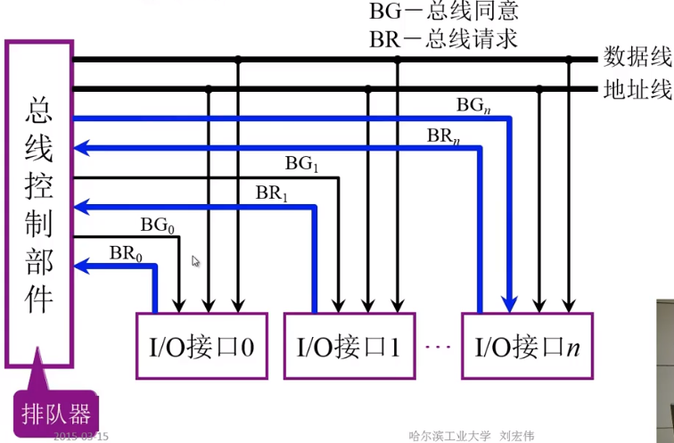

  所有的IO接口都增加了两条线：$BR_i$（提出总线占用请求）和$BG_i$（应答信号）

  可根据BG直接将总线的控制权分配给获得授权的设备

  总线控制部件中设置排队器控制设备优先级的排队

  优先级可以事先确定，还可以设置自适应优先级，根据实际情况分配合理的优先级

总线的判优控制解决了由哪一个主设备占用总线和使用总线

2. 总线通信控制

主设备获得总线的使用权后，将与从设备进行信息交换

总线通信控制：解决主设备和从设备**协调控制**的问题

* 总线的传输周期

  主设备和从设备之间完成一次完整的、可靠的通信所需要的时间
  
  * 申请分配阶段：主设备申请，总线总裁决定（总线判优）
  * 寻址阶段：主设备向从设备发出地址和命令
  * 数据传输阶段：主设备和从设备交换数据
  * 结束阶段：主从模块撤销有关信息
* 总线通信的四种方式
  * 同步通信：有统一的（定宽，定距）的时标控制数据的传送
  * 异步通信：采用应答方式，没有公共适中标准
  * 半同步通信：同步、异步结合，解决不同速度的两个设备之间通信的问题
  * 分离式通信：充分挖掘系统总线每个瞬间的潜力，让系统总线发挥最大效能

#### 同步通信
* 同步式数据输入

  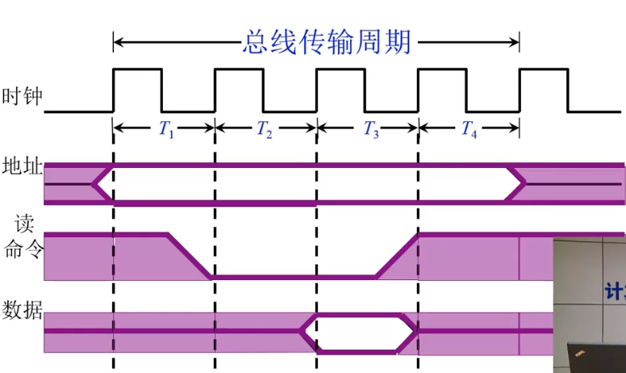

  整个总线周期由四个时钟周期构成 

  * 在T1时钟周期的上升沿，主设备给出从设备地址信息
  * 在T2时钟周期的上升沿，主设备给出读取命令
  * 在T3时钟周期的上升沿到来之前，从设备必须给出数据信号
  * 在T4时钟周期的上升沿，撤销控制信号和数据信号。在T4结束时候撤销地址信号

  特点：
  * 定宽定距的时钟控制数据传输的过程
  * 在给定的时间点上要完成相应的操作

* 同步式数据输出

  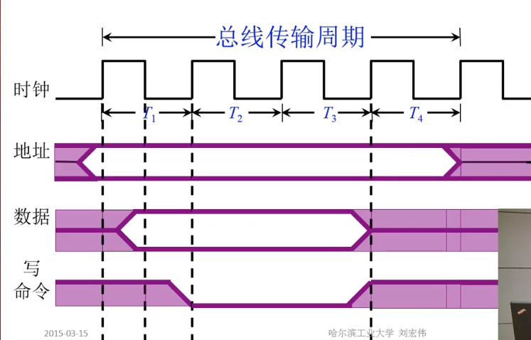

  * 在T1时钟周期的上升沿，给出地址信号，下降沿，给出数据
  * 在T2时钟周期的上升沿，给出写命令
  * 在T3时钟周期的上升沿，做写入操作
  * 在T4时钟周期的上升沿，主设备撤销写入命令，T4结束时撤销数据信号

  所有的从模块都用同一个时标控制，主从模块强制同步，对多个速度不同的模块需要选择速度最慢的模块设计时标，影响总线的工作效率，设计具有局限性，且缺乏灵活性
  
  同步通信一般应用于总线长度较短，且各个模块存储时间比较一致的情况。
  
  总线传输周期越短，数据线的位数越多

#### 异步通信

没有公共的时钟标准，不要求所有部件严格的统一操作时间，采用应答方式通信

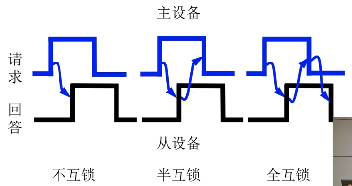

* 不互锁

  主设备发出请求后不必等待从设备的相应，经过一段时间后自动撤销请求信号。从设备发出应答后，经过一段时间自动撤销应答信号

  通信的可靠性低

* 半互锁

  主设备发出请求后，等待从设备发出的应答信号，接收到后则撤销请求信号，否则一直保留。但从设备应答后，经过一段时间自动撤销应答信号。

  可能会造成请求信号的长时间保留

* 全互锁

  主设备发出请求信号，从设备接收到请求后发出应答信号，主设备收到应答信号后撤销请求信号，从设备获知请求信号已撤销后，才会撤销应答信号。

  可以完成较为可靠的数据传输。

#### 半同步通信（同步、异步结合）

* 同步的特征：存在定宽定距的时钟管理通信的过程
  * 发送方用系统时钟前沿发出信号
  * 接收方用系统时钟后沿判断、识别

* 异步的特征：

  * 允许不同速度的模块和谐工作
  * 为了调整主从设备速度的差距，增加一条“等待”相应信号，$\overline{\text{WAIT}}$

* 以输入为例的半同步通信时序图

  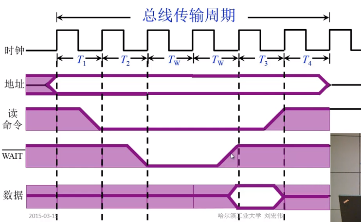 

  在T3上升沿到来之前，从模块若无法向主模块提供数据，则发出$\overline{\text{WAIT}}$信号，低电平有效。主模块若检测到$\overline{\text{WAIT}}$为低电平，则等待一个时钟周期T，如此循环，直到主模块检测到$\overline{\text{WAIT}}$为高电平，表示从模块已经准备好。则进入T3。

  * $T1$  主模块发地址
  * $T2$  主模块发命令
  * $T_w$ 当$\overline{\text{WAIT}}$$为低电平时，等待一个T
  * $T_w$ 当$\overline{\text{WAIT}}$$为低电平时，等待一个T
  * ···
  * ···
  * $T3$ 从模块提供数据
  * $T4$ 从模块撤销数据，主模块撤销命令

#### 分离式通信

充分挖掘系统总线每个瞬间的潜力

* 三种通信的共同点：

  * 主模块发地址、命令，需要占用总线
  * 从模块准备数据，不需要占用总线，总线空闲
  * 从模块想主模块发送数据，需要占用总线

* 将一个总线的传输周期分成两个子周期：
  * 子周期1：主设备申请占用总线，使用完后放弃总线的使用权
  * 子周期2：从设备完成准备工作后，申请占用总线，将各种信息发送至总线上

* 分离式通信的特点

  * 各个模块都有权申请占用总线
  * 采用同步方式通信，不等待对方应答
  * 各个模块准备数据时，不占用总线
  * 总线被占用时，无空闲

## 第四章 存储器
### 4-1 概述
#### 4-1-1  存储器分类
1. 按存储介质分类
  * 半导体存储器
    * TTL（晶体管-晶体管逻辑电路）：集成度低，功耗高，速度快
    * MOS（金属氧化物半导体）：功耗低，集成度高。
  * 磁表面存储器：磁头、磁载体
  * 磁芯存储器：硬磁材料、环状元件
  * 光盘存储器
2. 按存取方式分类
  * 存取时间与物理地址无关（随机访问）
    * 随机存储器（RAM）：在程序执行过程中可读可写
    * 只读存储器：在程序的执行过程中只可读
  * 存取时间与物理地址有关（串行访问）
    * 顺序存取存储器，如：磁带
    * 直接存取存储器，如：磁盘
3. 按存储器在计算机中的作用分类
  * 主存储器
    * 随机访问存储器RAM
      * 静态RAM
      * 动态RAM
    * 只读存储器ROM
      * MROM：掩模式
      * PROM：可编程
      * EPROM：电可编程
      * EEPROM：电可擦写
  * Flash Memory：半导体存储器，可作为：
    * 便携式存储器（U盘）
    * 硬盘（SSD）
    * 辅存的缓存
  * 高速缓冲存储器（Cache）：在CPU和主存之间的缓存
  * 辅助存储器

#### 4-1-2  存储器的层次结构

1. 存储器的层次结构
    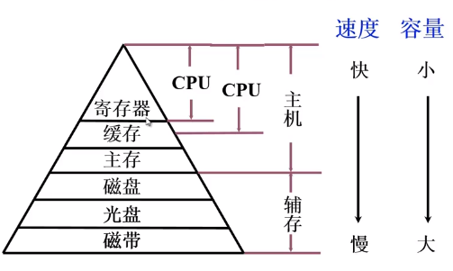
2. 缓存-主存层次和主存-辅存层次
  * 缓存-主存层次
    * 主要解决CPU和主存**速度**不匹配的问题。
    * 采用**硬件**的方法实现。
    * 地址空间为主存的地址（实地址）（物理地址）
  * 主存-辅存层次
    * 主要解决存储系统**容量**的问题。
    * 采用**软硬件相结合**的方法实现。
    * 地址空间为虚拟地址（逻辑地址）

### 4-2  主存储器

#### 4-2-1 概述
1. 主存的基本组成

  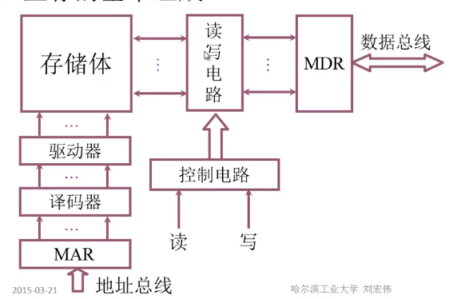

   MAR中的存储单元的地址需要译码器译译码后才能找到所需访问的单元。

   MDR中存储将要被读出或写入的数据。经过读写电路和控制电路控制读或写。若是读出，则将MAR指定的存储单元中的数据送到MDR中。若是写入，则将MDR中的数据送入到MAR指定的存储单元中

2. 主存和CPU的联系

  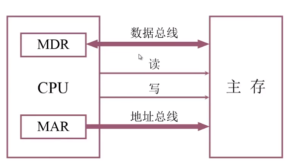

  数据总线：双向连在MDR寄存器上，完成了CPU和主存之间的信息传输。

  地址总线：单向连在MAR寄存器和主存的地址总线之间，给出了将要访问的内存单元的地址

  控制总线：读写等

3. 主存中存储单元的地址分配

  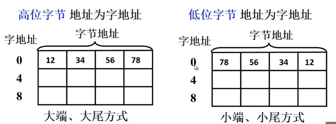

  * 大端法：高位存放高地址，低位存放低地址
  * 小端法：高位存放低地址，低位存放高地址

4. 主存的技术指标
* 存储容量：主存中存放的二进制数的总位数
* 存储速度：
  * 存取时间：存储器的访问时间
  
    从存储器给出地址信号开始，到得到稳定的数据输出/输入所经历的时间
    * 读出时间
    * 写入时间
  * 存取周期：**连续**两次**独立**的存储器操作（读或写）所需要的**最小**时间间隔

  一般来说，存取周期比存取时间长。因为连续的存取之间存在一段恢复时间

* 存储器带宽：单位时间里能够向存储器中读取/写入的数据的位数。

  单位：位/秒

#### 4-2-2  半导体存储芯片

1. 半导体存储芯片的基本结构
    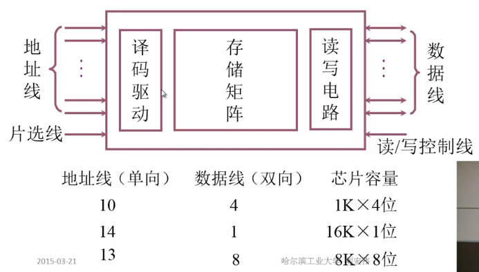

  * 地址线单向输入（n条），数据线双向（m条）。 
  
    芯片容量为$2^n×m$

  * 片选线：选择存储芯片。因为一个半导体存储器是由多个存储芯片构成。

    两种标识方式（一横表示低电平有效）

    * $\overline{\text{CS}}$：芯片选择
    * $\overline{\text{CE}}$：芯片使能

  * 读/写控制线：决定芯片进行读还是写操作
  
    一根线：
    * $\overline{\text{WE}}$：低电平写，高电平读
    
    两根线
    * $\overline{\text{OE}}$：读
    * $\overline{\text{WE}}$：写

#### 4-2-3  随机存取存储器

1. 静态RAM(SRAM)

  * 静态RAM基本电路

    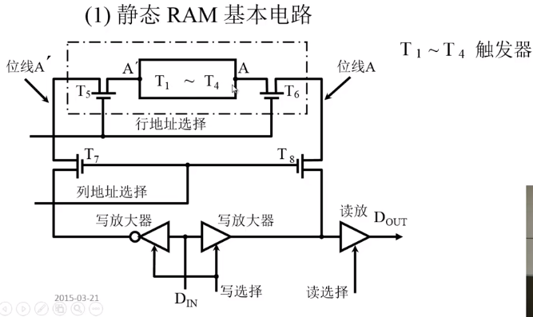
   
    T1-T6只是静态RAM的一个基本单元电路，有多行多列的基本单元一起构成静态RAM

    T1-T4为一个双稳态的触发器，存放0/1信息。A高A'低时为‘1’；A低A'高时为‘0’

    T5、T6用于决定读或写。T5、T6打开后该单元才能进行读/写。行开关

    T7、T8用于决定有效输入/输出的列。T7、T8打开后，该列对应的基本单元的读/写操作有效

    行地址选择线选择对基本单元矩阵中的哪一行的触发器进行操作，行有效时，将这一行中基本单元的T5和T6打开。

    列地址选择线决定哪一列的输入输出操作有效，列有效时，将这一列中的T7、T8开关打开。。

    *所以只有行选择线选择的行和列选择线选择的列才能进行有效输入或输出*

2. 动态RAM(DRAM)

* 用电容保存0/1信息

电容上如果保存了足够的电荷则存储'1'，若没有电荷则保存'0'

* 动态RAM基本单元电路
  
  （1）三管MOS动态RAM

  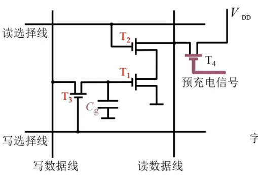
  * 信息保存在电容Cg上
  * T1、T2、T3为控制读出和写入的控制管
  * 读选择线有效，则T2导通
  * 写选择先有效，则T3导通

  读数据时
  * 预充电信号有效，T4打开
  * $V_{DD}$通过T4给读数据线充电，使得读数据线为高电平。
  * 读选择线有效使T2打开
  * 此时若Cg未保存电荷（保存信息0），则T1不导通，读数据线持续高电平，输出1
  * 若Cg保存了电荷（保存信息1），则T1导通，读数据线的高电平会通过T1接地，从而变为低电平，输出0.
  
    输出的信息与Gg中保存的信息相反，通常在读数据线的输出端加一个非门

  写数据时
  * 写选择线有效，T3导通
  * 写1，则写数据线通过T3向Cg充电
  * 写0，则Cg通过T3放电
  
    写入的信息与输入的信号是相同的

  (2)单管MOS动态RAM

  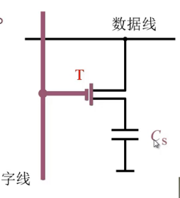

  读数据时
  * 字线有效，T导通
  * 若Cs中存储了电荷，则数据线上有电流，输出1
  * 若Cs中未存储电荷，则数据线上无电流，输出0

  写数据时
  * 字线有效，T导通
  * 写1，数据线通过T向Cs充电，输入1
  * 写0，Cs通过T放电，出入0

* 动态RAM刷新

刷新：现将原存信息读出，再由刷新放大器形成原信息并重新写入的再生过程。刷新只与行地址有关
  * 集中刷新
  * 分散刷新
  * 异步刷新

* 动态RAM和静态RAM的比较
  ||DRAM|SRAM|
  |--|--|--|
  |存储原理|电容|触发器|
  |集成度|高|低|
  |芯片引脚|少|多|
  |功耗|低|高|
  |价格|低|高|
  |速度|较慢|快|
  |刷新|需要|不需要|
  
  通常DRAM用于做主存，SRAM用于做缓存

#### 4-2-4  只读存储器(ROM)

1. 掩模ROM（MROM）

    行列选择线交叉处：
  * 有MOS管，则输出为1
  * 无MOS管，则输出为0
2. PROM（一次性编程）
  
    行线为基极，发射极与列线之间有一条熔丝：
  * 熔丝通，则为1
  * 熔丝短，则为0
3. EPROM（可多次编程）

  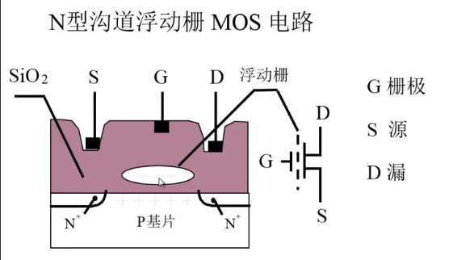
  * D端加正电压，形成浮动栅，S与D不导通，为0
  * D端不加正电压，不形成浮动栅，S与D导通，为1

    信息的擦除：驱散浮动栅。用紫外线擦除 

4. EEPROM（可多次编程）
  * 电可擦写
  * 局部擦写
  * 全部擦写
5. FlashMemory(闪速型存储器)

总结：
* EPROM：价格便宜，集成度高
* EEPROM：电可擦写
* FlashMemory：比EEPROM快，具备RAM功能

#### 4-2-5  存储器与CPU的连接
1. 存储容量的扩展
* 位扩展（增加存储字长）
  
  例：用2片1K×4位存储芯片组成1K×8位存储器 

  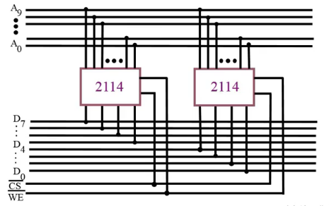

  1K表示有10根地址线，8位表示8根数据线。
  * 两个芯片地址线连接方式相同
  * 数据线各自负责按序的四位存储
  * 将两个芯片的**片选线**和**读写信号线**连接在一起，使得两个芯片同时工作。
* 字扩展
  
  例：用2片1K×8位存储芯片组成2K×8位存储器 

  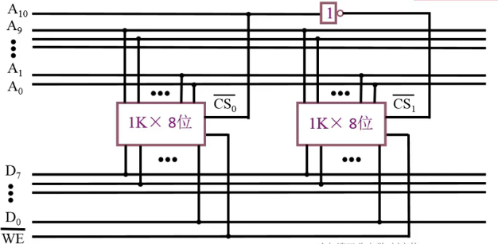

  2K表示有11根地址线，8位表示8根数据线。表示8位数据，所以两芯片不能同时被选中。原有的两个芯片有10根地址线A0-A9，组成的存储器增加了一条A10地址线。控制两个芯片的片选信号，A10为1，则选第一个芯片；A10为0，则选第二个芯片。

  * 从000 0000 0000开始，到011 1111 1111为第一个芯片的1K的空间
  * 从100 0000 0000开始，到111 1111 1111为第二个芯片的1K的空间
* 字、位扩展
  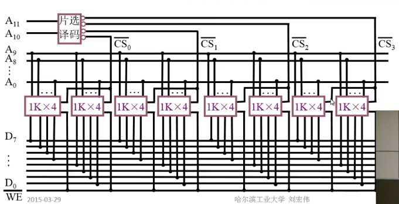
  
  * 先完成位的扩展
  
    用两个1K×4位的芯片组成一个1K×8位的存储器。所以可将八个1K×4位的芯片组成4组这样的存储器。每组的两个芯片的片选线相连。
  * 再完成字的扩展
    
    原芯片1K地址线为10根，4K芯片地址线为12根。多出的两根地址线A10和A11通过2-4译码器控制每一组的片选。

  以上操作即完成了字、位扩展

2. 存储器与CPU的连接
* 地址线的连接  

  存储芯片的容量不同，其地址线数也不同，CPU的地址线数往往比存储芯片的地址线数多。通常将CPU地址线的低位与存储芯片的地址线相连；高位用于扩充和其他用途

* 数据线的连接
  CPU与存储芯片的数据线数不等时，必须对存储芯片扩展位，使得其数据位数与CPU的数据线数相等

* 读/写命令线的连接

  CPU的读写命令线一般可直接与存储芯片的读写控制端相连
* 片选线的连接
* 合理选择存储芯片
  
  指存储芯片类型（RAM或ROM）和数量的选择

#### 4-2-6  存储器的校验

* 编码的检测能力和纠错能力与任意两组合法代码之间**二进制位**的**最少差异数**有关

* 具有一位纠错能力
  
* 代码长度与检测位数的关系
  
  $2^k = n + k + 1$  
  
  * n为将要检测的二进制代码的位数  
  * k为需要添加的检测位数  
  
  将k位检测位记为$C_i (i=1,2,4,...,2^i)$, 将这些位分别安插在汉明码从左往右的第$k=1,2,4,...,2^i$位上

  每个$Ci$分为一组，各承担n+k位数据的检测。第$C_i$组负责的数据位为：
  
  
    * 根据汉明码的总二进制位数n+k，固定从右往左数第Ci位为1，统计其余位根据0/1所有的排列组合结果转换为十进制的集合
    * 每个集合元素n表示附加了检测位的汉明码从左往右数的第n位的下标
    * 第$C_i$组负责的数据位为对应集合中的下标的对应位值
  
  从附加了检测位的汉明码中找出各个集合元素对应下标位置的二进制值，并判断1的数量：
    * 奇校验：填充$C_i$使得1的总数为奇数
      * 若1的总数为奇数，则$C_i = 0$
      * 若1的总数为偶数，则$C_i = 1$
    * 偶校验：填充$C_i$使得1的总数为偶数
      * 若1的总数为偶数，则$C_i = 0$
      * 若1的总数为奇数，则$C_i = 1$

#### 4-2-7  提高访存速度的措施

1. 单体多字系统

    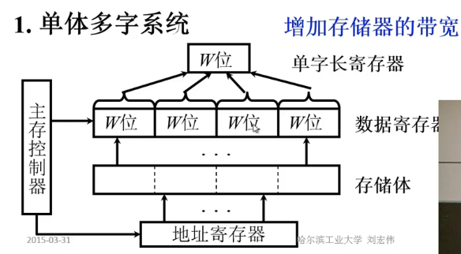
   
    在一个存取周期内，从同一地址取出多条指令，然后再逐条将指令送入CPU执行

  * 缺点：
    * 写入时，CPU先单字长的存储字写入单字长寄存器，再写入到多个字长的数据寄存器中，最后写入到存储器中。将会导致给定的存储体有多个字长的数据被修改
    * 指令和数据在主存内必须连续存放

2. 多体并行系统

（1） 高位交叉，顺序编址

  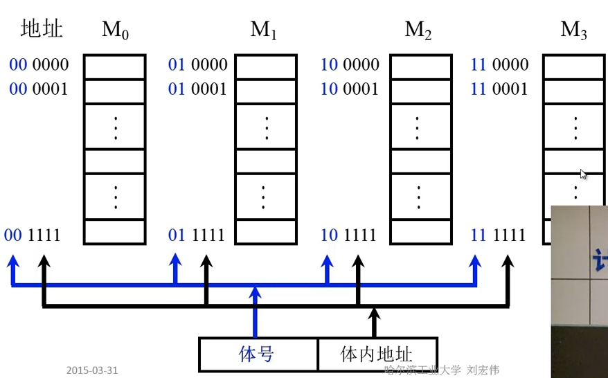

  高位地址表示存储体编号，低位地址表示存储体内地址 

  因为程序指令按序执行，连续的指令可能存储在同一个存储体中，可能会导致某些存储体繁忙，其余存储体空闲的情况，并行度低

  适合存储器容量的扩展，但是并不适合提高存储器的带宽

（2）低位交叉，各个存储体轮流编址

  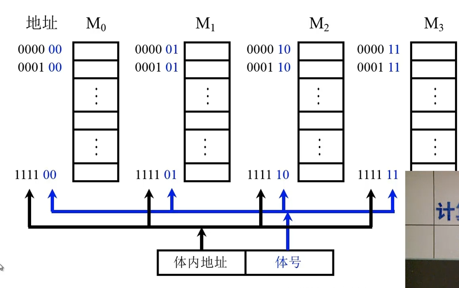

  低位地址表示存储体编号，高位地址表示存储体内地址

  连续的地址分布给不同的存储器，使得CPU可以在同一个访存周期内可以向多个存储体发出读信号，多个存储体在访存周期结束时可以同时向CPU提供数据

  低位交叉的特点：在不改变存取周期的前提下，增加存储器的带宽

  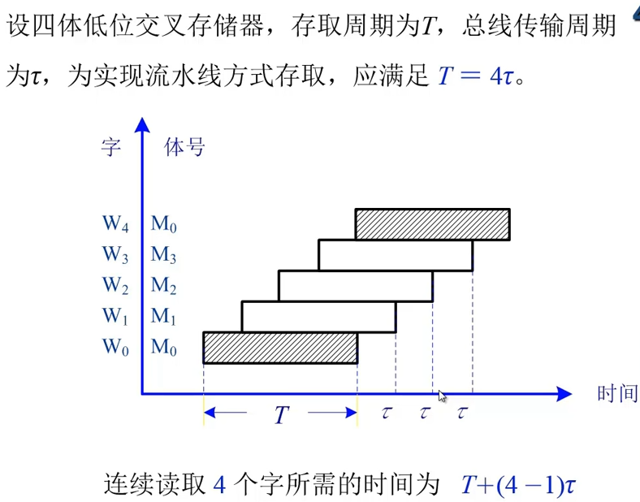

3. 高性能存储芯片

（1）SDRAM（Synchronous DRAM，同步DRAM）

  存储器与处理器的数据交换同步与系统的时钟信号。要求存储器的速度非常快

（2）RDRAM

（3）带Cache的DRAM

### 4-3  高速缓冲存储器
#### 4-3-1 概述

1. 主存速度的提高跟不上CPU的发展，高速缓存主要解决主存与CPU速度不匹配问题。Cache由静态RAM做成，容量小，速度快。
   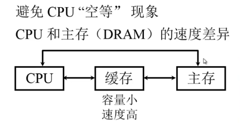
* 时间的局部性
  * CPU从主存中取指令或数据，在一定时间内，只是对主存局部地址区域的访问。
  * 当前正在使用的指令和数据在不久后很有可能会被再次使用
* 程序访问的局部性原理
   * 指令和数据在主存的地址分布不是随机的，而是相对的簇聚。
   * 当前正在使用某些指令和数据，不久后与其相邻的指令和数据就有可能会被使用

2. Cache的工作原理 
   
* 主存和缓存的编址

  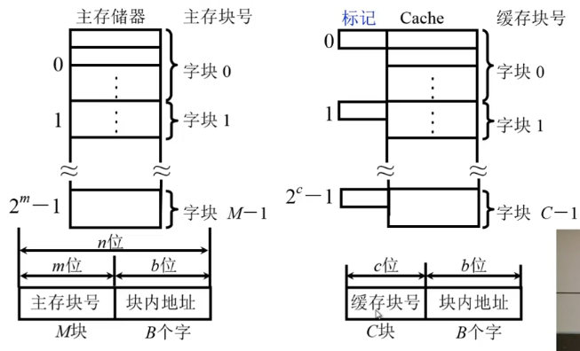

  ​	主存和缓存被分为大小相等的块，每个块表示一块连续的内存空间  
  ​	主存中有M块  
  ​	Cache中有C块  
  ​	C远远小于M

  * 内存和Cache的地址可分为两部分
    * 主存/缓存块号
    * 块内地址

    若一个块包含了16个字节，并且内存的编址单位是字节，则块内地址为4位，剩余的部分即为主存块号

  * Cache块内地址长度与主存块内地址长度相同、内容为某主存块的块内地址
  * Cache标记保存主存块和Cache块的对应关系。若主存块被写入到Cache块，则Cache标记则记录此主存块号，块内地址即为此**主存块的块内地址**
  * CPU读取信息时给出一串由块号和块内地址组成的内存地址，将主存块号与Cache的标记比较，
    * 若可以找到相等的块号且此Cache块有效，则称**Cache命中**。CPU可从此Cache块中得到想要的数据，速度较快
    * 若找不到，则称**Cache未命中**。CPU必须从主存中获取相应的数据或指令

  * Cache命中率=命中次数 / （命中次数+未命中次数）

    * 命中率与Cache的**容量**与**块长**有关
  
      * 通常每块可取4~8个字
      * 块长取一个存取周期内从主存调出的信息长度
  
  * Cache-主存系统的效率

    效率e与命中率有关
  
    $$e = \frac{访问Cache的时间}{平均访问时间} × 100\%$$
  
	  * 访问Cache的时间：CPU访问一次Cache需要的时间
    * 平均访问时间：CPU访问主存或Cache每次的平均时间
  
	设Cache**命中率**为h， 访问Cache时间为$t_c$, 访问主存的时间为$t_m$，则
  
  $e = \frac{t_c}{h×t_c+(1-h)×t_m} ×100\%$  （CPU访问Cache与访问主存并行进行）
  
  $e = \frac{t_c}{2 × h×t_c+(1-h)×t_m} ×100\%$  （CPU先访问Cache再访问主存）

3. Cache的基本结构

   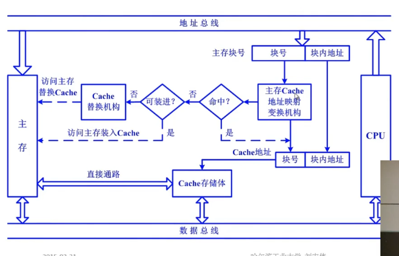

   * 地址映射变换机构
     * 地址的映射。决定主存中的块将会放入到Cache的那些块中
     * 地址的变换。将主存的块号/地址转换成相应的Cache的块号/地址

   * Cache存储体：以块为单位与主存交换信息
   * 替换机构：当Cache容量已满，则调用替换算法将某些块移出Cache，将新的块调入Cache

4. Cache的读写操作

  （1）读

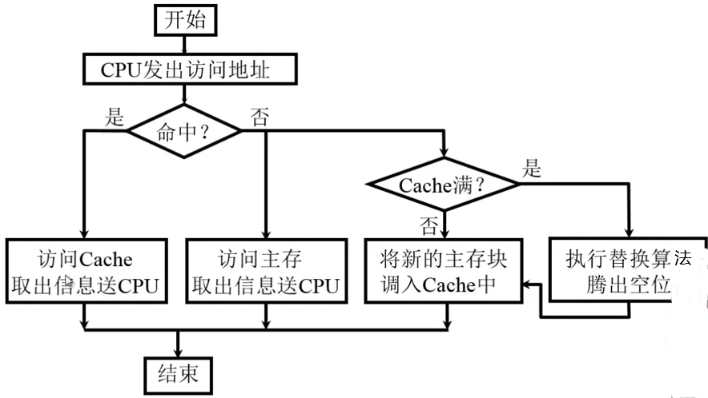

​	（2）写

* 写直达

  写操作时数据既写入Cache又写入主存。写操作的时间就是访问主存的时间

* 写回法

  写操作时只把数据写入Cache而不写入主存，当Cache数据被替换出去时才写回主存。写操作的时间为访问Cache的时间

5. Cache的改进

（1）增加Cache的级数

​	片内Cache、片外Cache

（2）统一缓存和分立缓存

​	统一缓存：指令和数据都存放在同一缓存内的Cache

​	分立缓存：指令和数据分别存放在两个缓存中，一个称指令Cache，一个称数据Cache

###  4.3.2. Cache-主存地址映射

1. 直接映射

   主存中任意一个给定的块，只能映射到某一个指定的Cache块中

   

   将主存储体划分为若干个与Cache大小相等的区，每个区中包含的字块数与Cache中的字块数相等。每个区从0开始给字块编号。

   映射时，每个区的第0块只能被放入到Cache的第0块；每个区的第一块只能放入Cache的第一块；……

   主存地址被划分为三部分。

   即每个缓存块可以和若干个主存块对应，但每个主存块只能和一个缓存块对应

   * 主存字块标记：即区号，写在Cache标记中
   * Cache字块地址
   * 字块内地址

   优点：

   * 结构简单
   * 速度快

   缺点：

   * Cache的利用率可能会很低
   * Cache映射时，冲突的概率较大

2. 全相连映射

   主存中的块可放入Cache的任意块中

   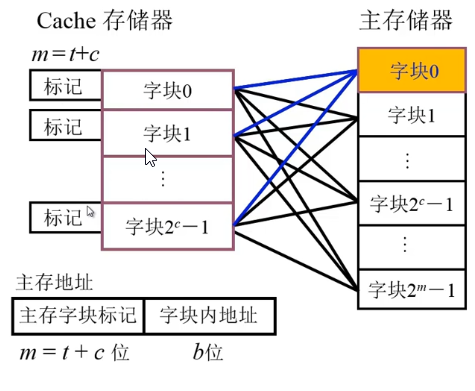

   优点：利用率高

   缺点：

   * 速度较慢。CPU给出主存地址，需要将该主存字块标记与所有Cache标记进行比较。有相同的则命中，否则未命中
   * 参加比较的位数较长。相较于直接映射，全相联没有根据Cache分区，所以主存字块标记较长，从而导致Cache标记较长

3. 组相连映射

    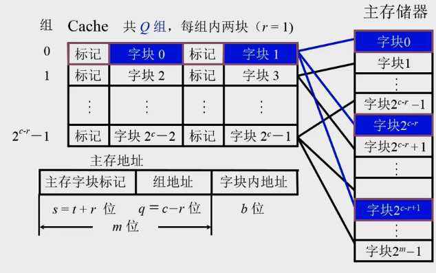

* 先将Cache字块分成**Q组**，每组中有$2^r$个字块。

* 理解性地再将主存储器的字块分成若干个**区**，每个**区的大小**和**Cache的组数**相同。
   
* 主存块j按照模Q的方式映射到缓存的第i组内，即：i = j mod Q。主存中按序的每Q个块分为一个区

* 映射时，每个区的第i号块可放到Cache第i组的任何一个位置，每个主存块在区内的偏移量直接决定了它可以放入到Cache的哪个组

* 比较时，先通过**主存字块标记模Q**确定给定的主存字块在哪个区，然后根据区内偏移找到对应的Cache组，将此组内所有字块的标记与**主存字块标记**比较，相同则命中，否则未命中

组相联映射方式是现代计算机Cache-主存地址映射常用的方法

* 若Cache只分为一组，则为全相联
* 若Cache每组只有一个字块，则为直接映射

小结

* 直接映射：某一主存块只能**固定映射**到某一缓存块
  * 不灵活
  * Cache利用率低
  * 速度快
* 全相联：某一主存块能映射到**任一**缓存块中
  * 成本高
  * 速度慢
  * Cache利用率高
* 组相联：某一主存快只能映射到某一**缓存组**中的**任一**缓存块中
  * 速度较快
  * Cache利用率较高
* 用途: 
  * 靠近CPU的Cache要求高速，可以采用**直接映射**，或路数比较少的**组相联映射**
  * 中间的Cache可采用**组相联映射**
  * 距离CPU较远的Cache可采用**全相联映射**

#### 4-3-3  替换算法

当新的主存块需要调入Cache并且它的可用空间又被占满时，需通过替换算法腾出一定的Cache空间

1. 先进先出算法（FIFO）

    选择最早被调入的Cache字块进行替换

2. 近期最少使用算法（LRU）
    选择近期用的最少的Cache字块进行替换

### 4-4  辅助存储器

保存数据

1. 概述
* 特点：不直接与CPU交换信息
* 磁表面存储器的技术指标
  * 记录密度
    * 道密度：磁盘沿半径方向单位长度的磁道数。单位：tpi(道每英寸)或tpm(道每毫米)
    * 位密度：单位长度磁道能记录二进制信息的位数。单位：bpi(位每英寸)或bpm(位每毫米)
    
    磁盘的每个磁道都是同心圆，越往外位密度越低

  * 存储容量：C = n × k × s
    * C：总存储容量
    * n：盘面数
    * k：每个盘面的磁道数
    * s：每条磁道上记录的二进制代码数
  * 平均寻址时间
    * 寻道时间：磁头在硬盘表面移动，找到指定的磁道需要的时间
    * 等待时间：磁头停止运动，磁盘旋转，等待所需扇区旋转到磁头下需要的时间
    * 平均寻址时间 = 寻道时间 + 等待时间
    * 辅存的读写时间 = 寻址时间 + 磁头读写时间
  * 数据传输速率Dr = 位密度Db × 磁道旋转速度V
  * 误码率：出错的信息位数与读出信息的总位数
2. 磁记录的原理
* 写
  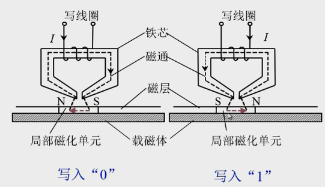
* 读
  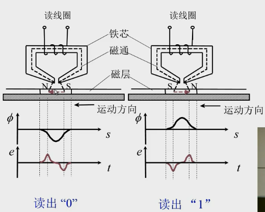
      
3. 硬磁盘存储器
* 类型
  * 固定磁头和移动磁头
    * 固定磁头：每个磁道都有一个磁头，磁头数量庞大，速度快，结构复杂
    * 移动磁头：每个盘面上一个磁头，磁头沿半径方向移动选择磁道
  * 可换盘和固定盘
* 硬磁盘存储器结构
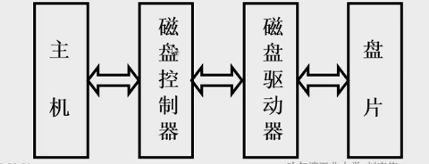
  * 磁盘控制器：
    * 接收主机发来的命令，转换成磁盘驱动器的控制命令
    * 实现主机和驱动器之间数据格式的转换
    * 控制磁盘驱动器读写
  
    磁盘控制器是主机与磁盘驱动器之间的接口
4. 软磁盘存储器

    不卖了

    ||硬盘|软盘|
    |--|--|--|
    |速度|高|低|
    |磁头|固定、活动，浮动|活动，接触盘片|
    |硬盘|固定盘|可换盘片|

5. 光盘存储器
   
    采用光存储技术，利用激光进行读写

* 只读型和只写一次型：热作用
* 可擦写光盘：热磁效应

## 5. 输入输出系统

### 5-1  概述

#### 5-1-1  输入输出系统的发展概况

略

#### 5-1-2  输入输出系统的组成

1. I/O软件
* I/O指令：机器指令的一类
  
  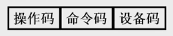
  * 操作码：相当IO指令的标志
  * 命令码：指出对具体IO设备的操作
  * 设备码：多台IO设备的选择码
* 通道指令（理解模糊）：
  * 通道能够实现I/O设备与主机直接进行信息传送 
  * 通道能够执行由通道指令组成的通道程序
  * 指出数据组的首地址、传送字数、操作命令
2. I/O硬件
* 设备
* 接口

  设备通过接口连接在总线上和主机完成信息交换

  若采用通道方式，则设备通过设备控制器连接在通道上与主机进行信息交换

3. I/O设备与主机的联系方式

* I/O设备编址方式
  * 统一编址
  
    将I/O设备的地址看做是存储器地址的一部分

    可用取数、存数指令访问I/O设备
  * 不统一编址
    
    在内存地址空间之外专门为I/O设备设置地址空间

    需要设置专门的I/O指令
* 设备选址
  * 用设备选择电路识别是否被选中
* 传送方式
  * 串行
  * 并行
* 联络方式
  * 立即响应
  * 异步工作采用应答信号联络
  * 同步工作采用同步时标
* I/O设备与主机的连接方式
  * 辐射式连接：每台I/O设备都有一套控制线路和一组信号线
  * 总线式连接：通过一组总线将所有的I/O设备与主机连接

4. I/O设备与主机信息传送的控制方式
* 程序查询方式
  
  CPU和I/O设备采用串行方式工作，CPU通过程序不断查询I/O设备是否做好准备。

  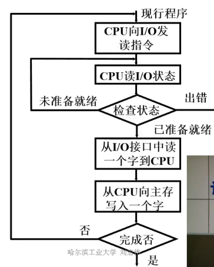

  CPU的速度比I/O设备快得多，等待I/O设备准备数据将会使CPU的工作效率大大降低

  同时，I/O设备访问内存也必须经过CPU

* 程序中断方式

  I/O准备数据时CPU仍可执行现行程序，I/O准备完成后发出中断请求，CPU转而执行中断服务程序为I/O设备服务，结束后回到原程序继续执行。

  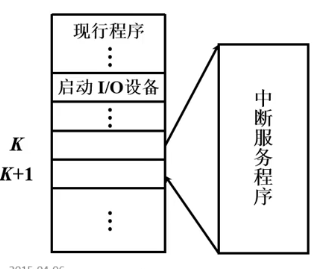

  CPU在执行第K条指令时收到了I/O的中断信号，在第K条指令执行结束后立即执行中断服务程序为I/O设备提供服务，执行完毕后转回原来的程序中执行下一条（第K+1条）指令。

  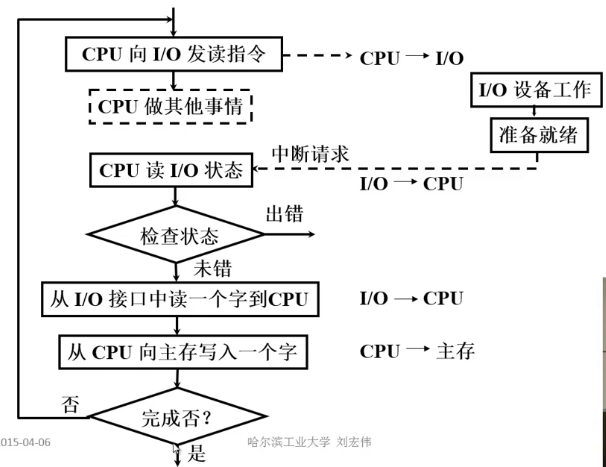

  实现了CPU和I/O部分的并行工作，但对CPU的解放仍不彻底，
    * 传输过程中需要CPU参与
    * 中断现行程序时候要保存程序断点
    * 程序返回时要恢复程序断点

* DMA方式
  
  上述两种方法中，I/O设备与内存之间的信息交换仍需通过CPU

  DMA方式在内存与I/O之间建立直接通路，不需要中断现行程序。若CPU和DMA同时访问主存，则CPU将总线占有权让给DMA，时间一般为一个存储周期，称为**窃取周期**或**挪用周期**

  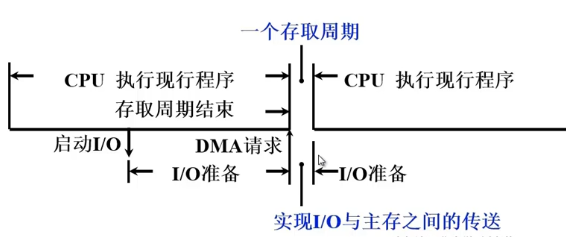

  CPU在程序运行的某个时刻发出启动I/O信号，之后I/O设备在DMA的控制之下完成数据的准备，准备完成后DMA发出总线占用请求，CPU让出一个存取周期的总线控制权给DMA，DMA将数据加载到主存中，期间CPU程序仍可执行，只不过不可以访存而已。

  实现了CPU和I/O的并行工作

* 三种方式的CPU工作效率比较
  
  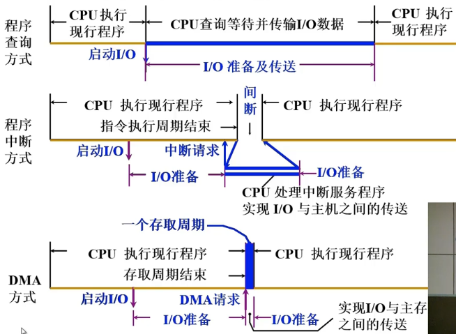

  * 程序查询方式

    I/O准备及传送的时间里，CPU一直在查询等待I/O设备，效率极低

  * 程序中断方式

    I/O准备数据时CPU不需要等待，提高了效率，但仍需要CPU参与I/O与主存之间的数据交换。CPU程序的中断和恢复也会消耗些许时间

  * DMA方式

    CPU仅在DMA请求占用总线时让出一个存取周期的总线，现行程序不需要中断。且现代计算机多为多指令存取，短时间的不访存对CPU来说影响较小，CPU工作效率高。

### 5-2 外部设备（I/O设备）

#### 5-2-1 概述

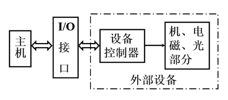

I/O设备由设备控制器与其机、电、磁、光部件组成，通过I/O接口与主机连接，主机通过I/O接口向设备控制器传输控制命令，控制I/O设备进行相关操作；也通过I/O接口读取设备的状态

I/O设备可分为三类

1. 人机交互设备：将人能识别的信息转换成机器可识别的信息
2. 计算机信息的存储设备
3. 机-机通信设备：计算机与其他计算机或其它系统之间完成通信任务的设备

#### 5-2-2 输入设备

1. 键盘
2. 鼠标
3. 触摸屏
   
#### 5-2-3 输出设备

1. 显示器
    * 字符显示：字符发生器
    * 图形显示：主观图像
    * 图像显示：客观图像
2. 打印机
    * 击打式
    * 非击打式

#### 5-2-4 其他

1. A/D、D/A转换器（模拟/数字、数字/模拟转换器）
2. 终端：完成现实控制、存储、键盘管理以及通信控制
3. 汉字处理

#### 5-2-5 多媒体技术

### 5-3 I/O接口

1. I/O设备的作用

   * 实现设备的选择
   * 实现数据缓冲达到速度匹配
   * 实现数据串-并格式的转换
   * 实现电平转换
   * 传送控制命令
   * 反映设备的状态

2. 总线链接方式的I/O接口电路

    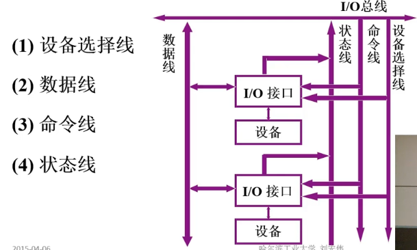

 * 设备选择线：传输参与本次信息交换的设备的设备码或端口号
 * 数据线：负责主机与I/O设备之间的数据传输
 * 命令线：负责传输CPU向设备发出的命令信号
 * 状态线：负责向主机报告设备状态

3. 接口的功能和组成

  |功能|组成|
  |--|--|
  |选址功能|设备选择电路|
  |传送命令功能|命令寄存器、命令译码器|
  |传送数据的功能|数据缓冲器|
  |反映设备状态的功能|设备状态标记|

  设备状态标记：

  * 完成触发器：D
  * 工作触发器：B
  * 中断请求触发器：INTR
  * 屏蔽触发器：MASK

4. I/O接口的基本组成

    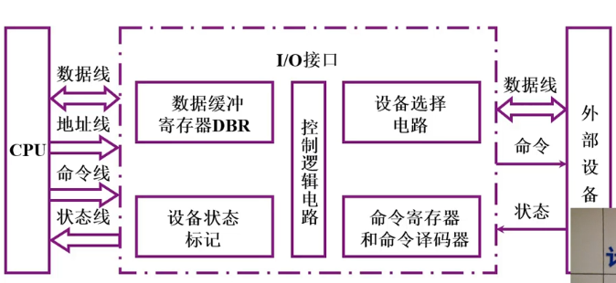

5. 接口类型

* 按数据传输方式分类
  * 串行接口
  * 并行接口
* 按功能选择的灵活性分类
  * 可编程接口
  * 不可编程接口
* 按通用性接口
  * 通用接口
  * 专用接口
* 按数据传送的控制方式分类
  * 程序型接口（中断接口）
  * DMA型接口
  
### 5-4 程序查询方式

#### 5-4-1 程序查询流程

1. 单个设备

    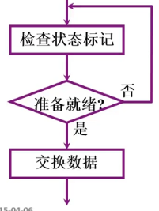

    CPU 在发出设备启动命令后循环检查状态标记，判断I/O接口是否准备好数据

    * 测试指令：检查状态标记
    * 转移指令：若设备未就绪，执行转移指令，再次执行测试指令
    * 传送指令：I/O设备准备就绪时，执行传送指令
2. 多个设备

    根据设备优先级将设备排序，高优先级的未准备就绪时，检查次优先级的状态标记

    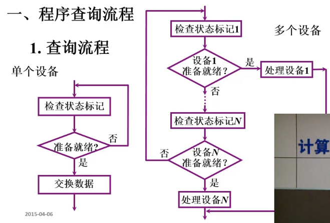

3. 程序流程

    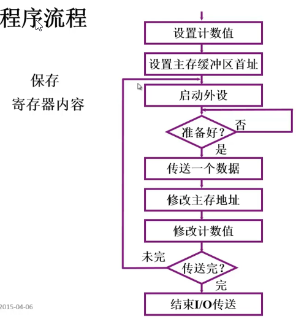

    * 保存寄存器内容
    * 设置计数值：控制传输的数据量
    * 设置将要传输的数据的主存缓冲区首地址
    * 启动I/O设备
    * CPU循环查询I/O接口的状态，直至I/O设备数据准备好，开始进行数据传输
    * 传送一个数据
    * 修改主存地址，为输入/输出下一个数据做准备
    * 修改计数值
    * 判断数据是否传送完

#### 5-4-2 程序查询方式的接口电路

**以输入为例**

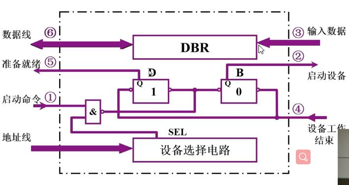

* CPU通过地址线给出外部设备的地址
* 设备选择电路将设备码与地址线上的代码比对，若一致，则SEL有效，说明本次启动的设备是连接在该接口电路上的设备
* 若SEL信号有效，且启动命令有效，则该设备开始工作
* I/O指令的启动命令将触发器B置“1”，设备启动；将D置“0”，数据为准备就绪
* 触发器B启动设备工作
* 输入设备将数据送至数据缓冲寄存器
* 至此设备工作结束，将B置“0”，将D置“1”，表示数据准备完毕
* CPU执行输入命令，将数据缓冲存储器中的数据经过一系列操作后存入主存